# NASA Patent Matching Tool: Architecture Analysis

> **Purpose:** A comprehensive technical comparison between the legacy system (Team E, Fall 2025) and the new serverless architecture. This document covers data pipelines, query flows, infrastructure, and key code references.

---

## Table of Contents

1. [Project Overview](#1-project-overview)
2. [Legacy System (Team E)](#2-legacy-system-team-e)
   - [High-Level Architecture](#21-high-level-architecture)
   - [Data Creation Pipeline](#22-data-creation-pipeline)
   - [Query Execution Flow](#23-query-execution-flow)
   - [UI and Application Layer](#24-ui-and-application-layer)
   - [Infrastructure Requirements](#25-infrastructure-requirements)
   - [Key Code Files](#26-key-code-files)
3. [New Serverless Architecture](#3-new-serverless-architecture)
   - [High-Level Architecture](#31-high-level-architecture)
   - [Data Pipeline](#32-data-pipeline)
   - [Query Execution Flow](#33-query-execution-flow)
   - [AI / RAG Layer](#34-ai--rag-layer)
   - [Infrastructure Requirements](#35-infrastructure-requirements)
4. [Side-by-Side Comparison](#4-side-by-side-comparison)
5. [Why the New Architecture is Better](#5-why-the-new-architecture-is-better)
6. [What to Preserve From the Old System](#6-what-to-preserve-from-the-old-system)

---

## 1. Project Overview

Both systems solve the same problem: **Given a patent, find the most semantically similar patents in the US patent corpus.** This helps NASA's Technology Transfer Office identify related prior art and innovation opportunities.

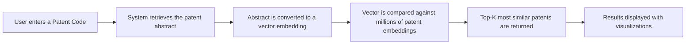

The core difference is **where and how** steps C and D happen.

---

## 2. Legacy System (Team E)

### 2.1 High-Level Architecture

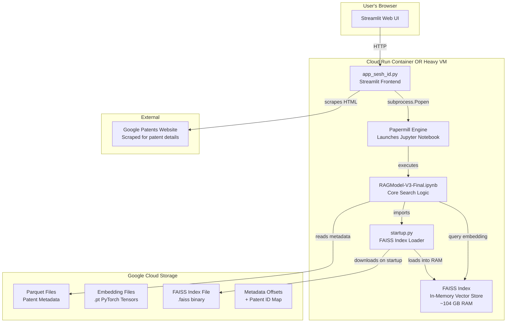

### 2.2 Data Creation Pipeline

This is the offline process that must run **before** any user can search. It is entirely manual and requires a GPU-equipped VM.

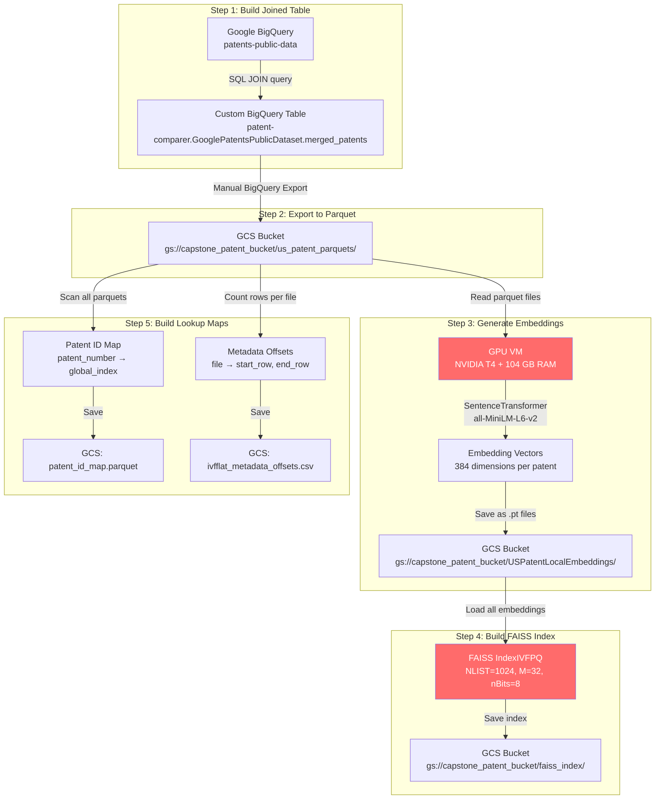

**Key details:**

| Step | Script | What It Does |
|------|--------|--------------|
| 1 | `create_joined_BQ_table.md` | SQL that JOINs `patents-public-data.google_patents_research.publications` with `patents-public-data.patents.publications`, filtered to US patents |
| 2 | Manual BigQuery Console | Export the joined table as Parquet files to a GCS bucket |
| 3 | `embedding_creation.py` / `title_keyword_embeddings_us.py` | Reads each parquet, concatenates title + abstract, runs through `all-MiniLM-L6-v2` on GPU, saves `.pt` tensor files |
| 4 | Built inside `RAGModel-V3-Final.ipynb` | Loads all `.pt` files, trains an IVF index, adds all vectors, saves the `.faiss` file to GCS |
| 5 | Built inside `RAGModel-V3-Final.ipynb` | Scans every parquet to build a `publication_number → row_index` dictionary |

**Time to complete:** Hours to days depending on corpus size. Entirely manual. Requires GPU.

### 2.3 Query Execution Flow

This is what happens when a user clicks "Run Search" in the UI.

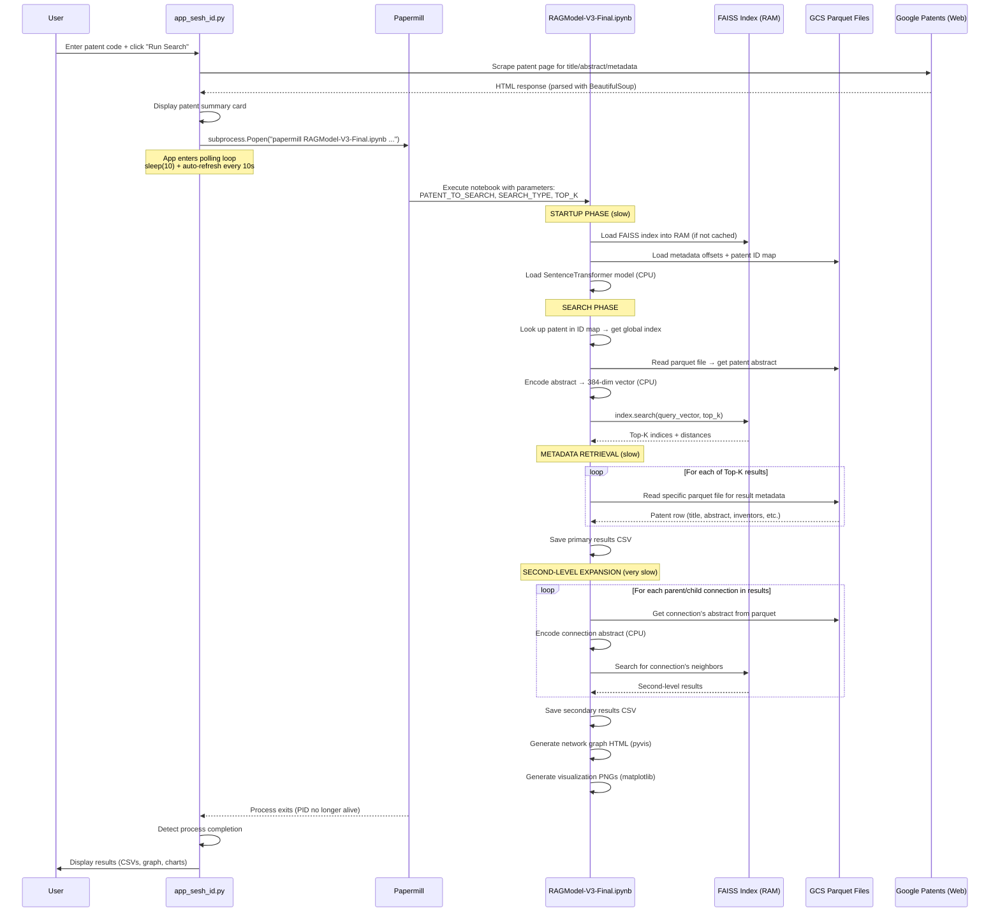

**Why this is slow:**

1. **Papermill overhead** - launching a full Jupyter notebook as a subprocess
2. **CPU-based embedding** - `SentenceTransformer` generates query embeddings on CPU (no GPU at runtime)
3. **Per-result parquet reads** - for each of the Top-K results, it reads a separate parquet file from GCS to get metadata
4. **Second-level expansion** - repeats the entire search process for every parent/child connection
5. **Sequential visualization** - generates matplotlib plots synchronously
6. **Polling loop** - the UI checks every 10 seconds if the process is done

### 2.4 UI and Application Layer

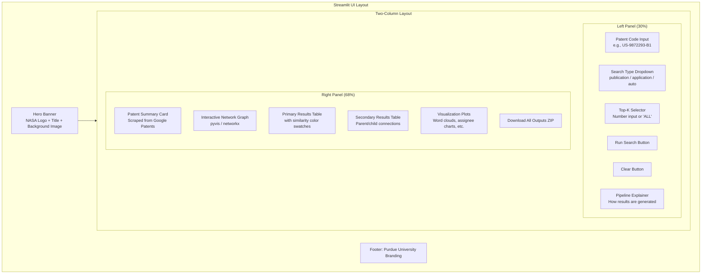

**Key UI features:**

- **Dark theme** - NASA blue (`#0B3D91`) primary color, near-black backgrounds
- **No authentication** - anyone with the URL can use it
- **Job queue system** - max 2 concurrent runs, additional requests are queued
- **Session management** - custom session IDs with timestamp-based prefixes
- **Process management** - tracks PIDs, supports cancel, reattaches on page refresh
- **Auto-refresh** - polls every 10 seconds while a job is running
- **Similarity legend** - color-coded swatches (red < 0.6, yellow 0.6-0.8, light green 0.8-0.9, green > 0.9)

### 2.5 Infrastructure Requirements

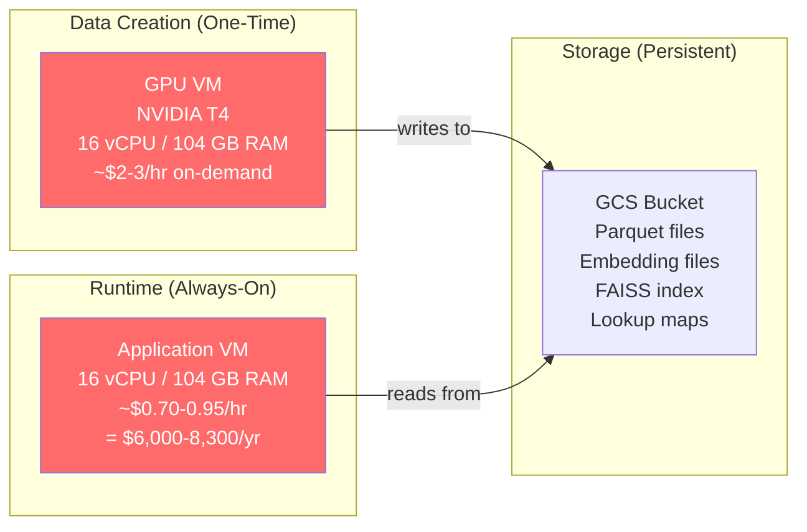

| Resource | Specification | Cost Estimate |
|----------|--------------|---------------|
| Runtime VM | 16 vCPU, 104 GB RAM (e.g., `n1-highmem-16`) | ~$6,000-8,300/yr (always-on) |
| GPU VM (data creation) | NVIDIA T4, 16 vCPU, 104 GB RAM | ~$2-3/hr (used periodically) |
| GCS Storage | Parquets + embeddings + FAISS index | ~$50-200/yr depending on size |
| **Total** | | **~$6,500-9,000/yr minimum** |

### 2.6 Key Code Files

```
project-mountainstar-final_code/
|
+-- README.md                          # Project overview, dependencies, system requirements
|
+-- RAG Model Package/
|   +-- app_sesh_id.py                 # Main Streamlit app (1,545 lines)
|   |                                  #   - UI layout, hero banner, input forms
|   |                                  #   - Job scheduling and queue system
|   |                                  #   - Process management (PID tracking, cancel)
|   |                                  #   - Google Patents scraping
|   |                                  #   - Results display (tables, graphs, downloads)
|   |
|   +-- RAGModel-V3-Final.ipynb        # Core search engine notebook (~1,800 lines)
|   |                                  #   - FAISS index loading/building
|   |                                  #   - SentenceTransformer embedding generation
|   |                                  #   - Primary search (rag_search_faiss)
|   |                                  #   - Second-level connection expansion
|   |                                  #   - Network graph generation (pyvis)
|   |                                  #   - Visualization plots (matplotlib)
|   |
|   +-- startup.py                     # FAISS index loader (209 lines)
|   |                                  #   - Downloads FAISS index from GCS
|   |                                  #   - Loads index into RAM
|   |                                  #   - Loads metadata offsets and patent ID map
|   |                                  #   - Concurrency-safe with .lock files
|   |
|   +-- app_start.sh                   # Launch script
|   |                                  #   - Starts Streamlit on port 8501
|   |                                  #   - Starts Cloudflare tunnel for public access
|   |
|   +-- streamlit/config.toml          # Streamlit theme configuration
|
+-- Instructions to Build Data and Run Environment/
|   +-- Data Creation Package/
|   |   +-- create_joined_BQ_table.md       # BigQuery SQL to create the merged patent table
|   |   +-- embedding_creation.py           # Local GPU script: parquet → embeddings (.pt files)
|   |   +-- title_keyword_embeddings_us.py  # GCS-based batch embedding script with progress tracking
|   |   +-- README - Update Data and Create Embeddings.md  # Step-by-step data pipeline instructions
|   |
|   +-- CloudRun Package and Instructions/
|   |   +-- Dockerfile                 # Docker image definition (python:3.11-slim)
|   |   +-- requirements.txt           # Python dependencies (faiss-cpu, torch, streamlit, etc.)
|   |   +-- cloudbuild.yaml            # Google Cloud Build automation
|   |   +-- README.md                  # Cloud Run deployment instructions
|   |
|   +-- Application Publishing and Deployment and Launch Guide.md
|                                      # Three deployment options:
|                                      #   A) Cloudflare Tunnel (quick demo)
|                                      #   B) Intranet IP (internal NASA access)
|                                      #   C) Public domain with Nginx + SSL
```

---

## 3. New Serverless Architecture

### 3.1 High-Level Architecture

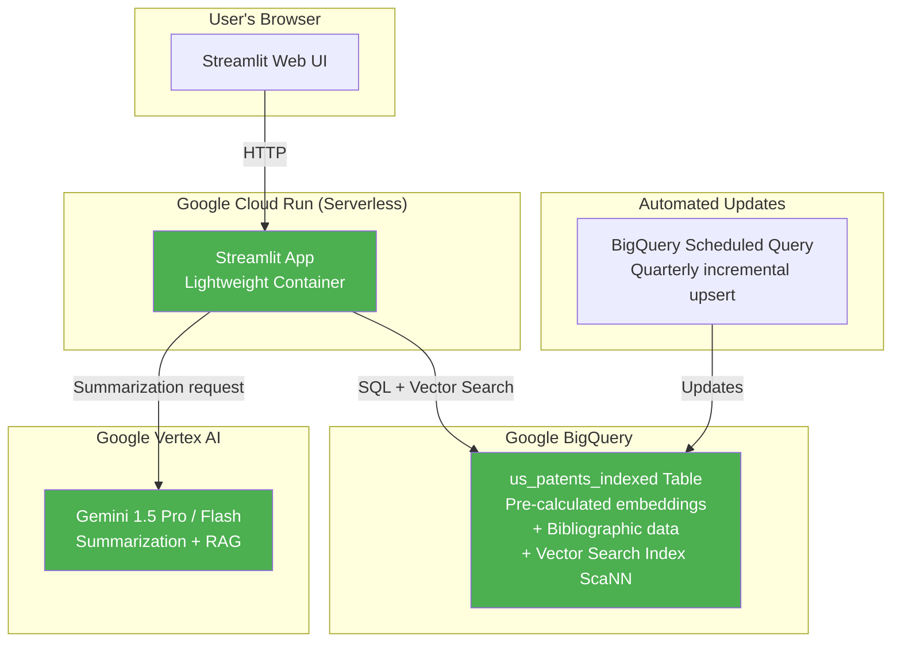

### 3.2 Data Pipeline

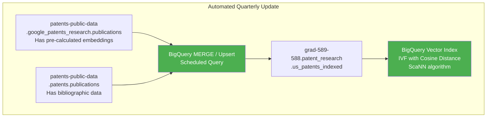

**Key differences from legacy:**

| Aspect | Legacy Pipeline | New Pipeline |
|--------|----------------|--------------|
| Trigger | Manual (human runs scripts) | Automated (BigQuery scheduled query) |
| Embedding generation | Custom GPU script (hours) | Pre-calculated by Google (free) |
| Index building | FAISS on local machine (hours) | BigQuery creates index automatically |
| Storage | Parquet files in GCS | BigQuery table (managed) |
| Frequency | Whenever someone remembers | Quarterly, automated |

### 3.3 Query Execution Flow

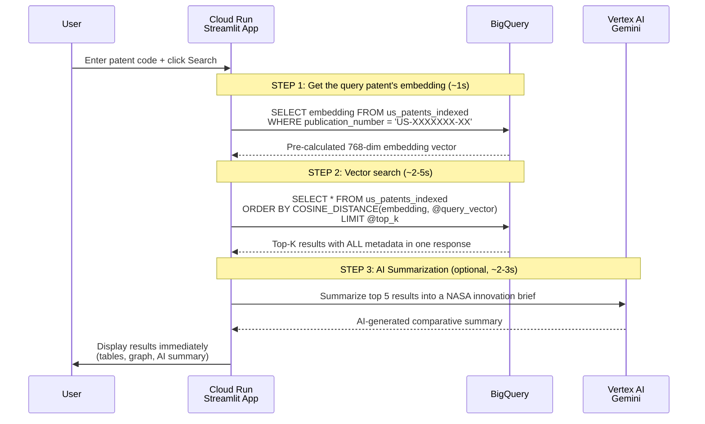

**Why this is faster:**

1. **No subprocess** - query runs inline, no papermill or notebook execution
2. **No embedding generation** - the query patent's vector already exists in the table
3. **No per-result metadata fetch** - BigQuery returns all columns in a single query
4. **No second file reads** - everything is in one table, one query
5. **Instant response** - total time is ~3-8 seconds vs minutes

### 3.4 AI / RAG Layer

This is a **new capability** that the legacy system does not have.

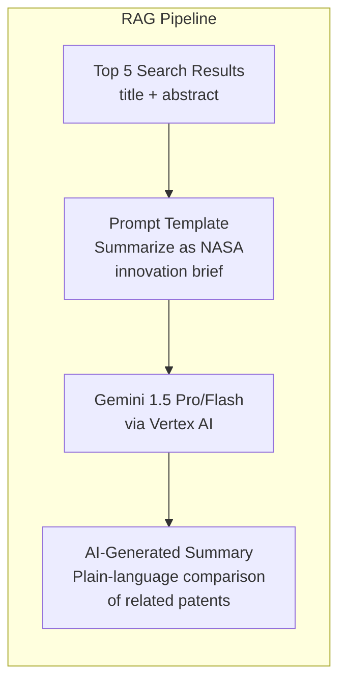

The legacy system only returned raw search results. The new system can generate a natural-language summary explaining how the results relate to the query patent.

### 3.5 Infrastructure Requirements

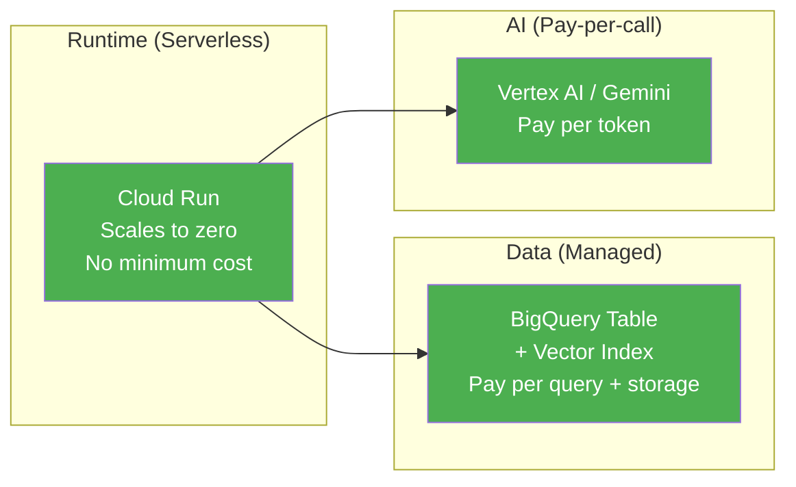

| Resource | Specification | Cost Estimate |
|----------|--------------|---------------|
| Cloud Run | Scales to zero, pay per request | ~$0-50/mo depending on usage |
| BigQuery Storage | Patent table with embeddings | ~$5-20/mo |
| BigQuery Queries | Vector search (scanned bytes) | ~$5/TB scanned |
| Vertex AI (Gemini) | Summarization per query | ~$0.001-0.01 per query |
| Scheduled Queries | Quarterly updates | ~$5/quarter |
| **Total (low usage)** | | **~$50-200/yr** |
| **Total (heavy usage)** | | **~$500-2,000/yr** |

---

## 4. Side-by-Side Comparison

### Architecture Comparison

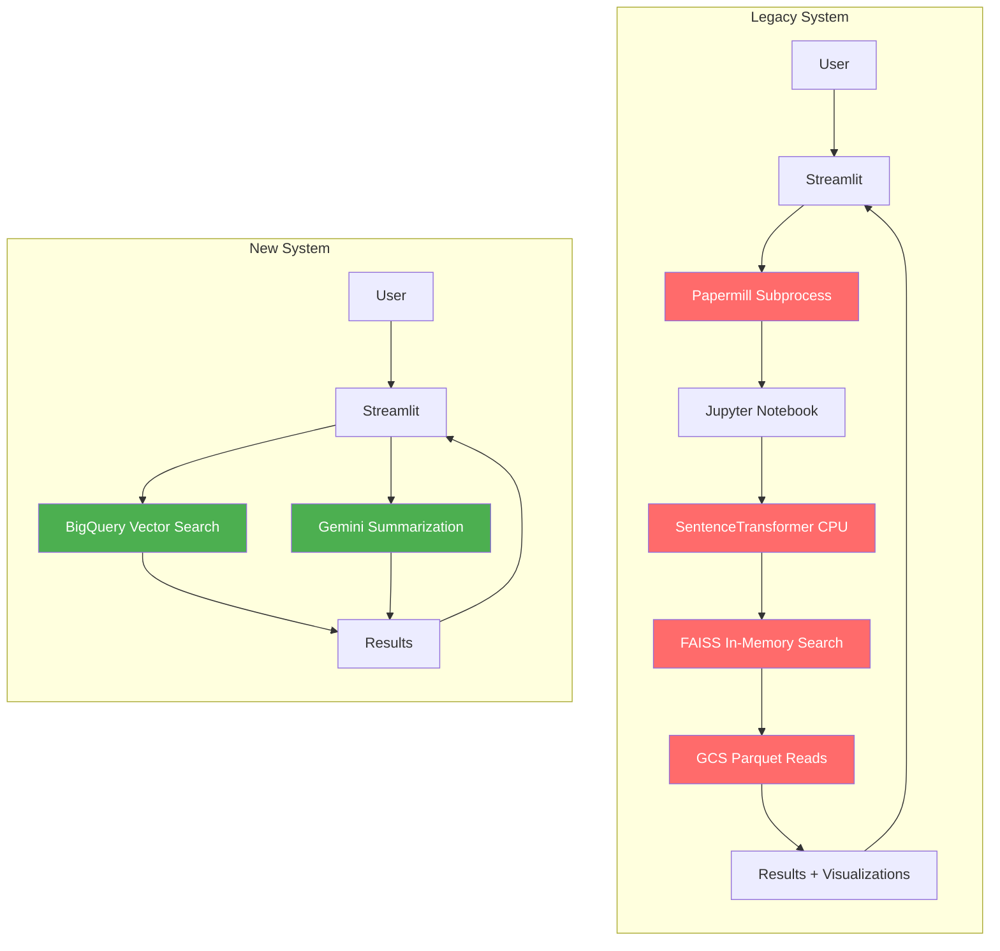

### Full Comparison Table

| Dimension | Legacy (Team E) | New (Serverless) |
|-----------|----------------|------------------|
| **Search engine** | FAISS (in-RAM, `faiss-cpu`) | BigQuery Vector Search (ScaNN) |
| **Embedding model** | `all-MiniLM-L6-v2` (384-dim, self-hosted) | Google's pre-calculated embeddings (in BQ table) |
| **Query embedding** | Generated at runtime on CPU (slow) | Looked up from table (instant) |
| **Metadata retrieval** | Per-result parquet file reads from GCS | Single BigQuery query returns everything |
| **End-to-end query time** | **Minutes** (notebook + CPU embed + parquet I/O) | **Seconds** (single SQL query) |
| **Data updates** | Manual multi-step GPU pipeline | Automated quarterly BigQuery scheduled query |
| **Infrastructure** | Always-on VM (16 vCPU, 104 GB RAM) | Serverless (Cloud Run, scales to zero) |
| **AI summarization** | None | Gemini 1.5 Pro/Flash via Vertex AI |
| **Authentication** | None (network-level only) | TBD (should add for NASA) |
| **Concurrency** | Max 2 jobs, custom queue system | Automatic (Cloud Run scaling) |
| **Cost (low usage)** | ~$6,500-9,000/yr | ~$50-200/yr |
| **Cost (heavy usage)** | Same (fixed VM cost) | ~$500-2,000/yr (scales with usage) |
| **Patent scope** | All US patents (no date filter) | Rolling 20-year window (2006+) |
| **Maintenance** | High (server management, index rebuilds) | Low (managed services) |

---

## 5. Why the New Architecture is Better

### 5.1 Eliminates the Biggest Bottleneck

The legacy system's critical path runs through a **104 GB RAM FAISS index**. This single dependency dictates the minimum server size, prevents scaling, and creates a fragile single point of failure. The new system eliminates this entirely by pushing vector search into BigQuery.

### 5.2 End-to-End Speed

```mermaid
gantt
    title Legacy Query Timeline (Minutes)
    dateFormat ss
    axisFormat %S s

    section Startup
    Load FAISS Index           :a1, 00, 30s
    Load Metadata Maps         :a2, after a1, 10s
    Load SentenceTransformer   :a3, after a2, 5s

    section Primary Search
    Scrape Google Patents       :b1, after a3, 5s
    Encode query on CPU         :b2, after b1, 3s
    FAISS search                :b3, after b2, 1s
    Read parquet for each result:b4, after b3, 20s

    section Second Level
    Expand connections          :c1, after b4, 60s

    section Output
    Generate visualizations     :d1, after c1, 10s
    Save files                  :d2, after d1, 2s
```

```mermaid
gantt
    title New Query Timeline (Seconds)
    dateFormat ss
    axisFormat %S s

    section Search
    BigQuery Vector Search     :a1, 00, 4s

    section AI
    Gemini Summarization       :b1, after a1, 3s

    section Display
    Render results             :c1, after b1, 1s
```

### 5.3 Operational Simplicity

| Task | Legacy | New |
|------|--------|-----|
| Update patent data | Run BigQuery SQL, export parquets, run GPU embedding script, rebuild FAISS index, upload to GCS, restart server | BigQuery scheduled query runs automatically |
| Scale for more users | Buy a bigger VM | Cloud Run auto-scales |
| Handle server crash | Manual restart, re-download FAISS index, wait for RAM load | Cloud Run restarts automatically |
| Monitor costs | Fixed monthly VM bill | Pay-per-use, visible in GCP billing |

### 5.4 One Caveat: Patent Scope

The legacy system indexed **all US patents** with no date restriction. The new system uses a **rolling 20-year window** (patents filed >= Jan 1, 2006). This means older foundational patents will not appear in search results. Verify this is acceptable for NASA's use case.

---

## 6. What to Preserve From the Old System

Not everything about the legacy system is bad. These elements are worth carrying forward:

| Element | Why It's Good | Where It Lives |
|---------|---------------|----------------|
| Interactive network graph | Excellent for visualizing patent relationships | `RAGModel-V3-Final.ipynb` (pyvis section) |
| Similarity color legend | Clear visual indicator of match quality | `app_sesh_id.py` (lines 1018-1098) |
| Patent summary card | Clean display of patent metadata | `app_sesh_id.py` (lines 390-436) |
| Two-column layout | Good UX pattern for search tools | `app_sesh_id.py` (lines 1101-1104) |
| Second-level expansion concept | Valuable for discovering patent clusters | `RAGModel-V3-Final.ipynb` (second connections section) |
| Download-all ZIP | Convenient for offline analysis | `app_sesh_id.py` (lines 132-189) |

These features can be reimplemented more simply with BigQuery as the backend, without the subprocess/papermill complexity.
