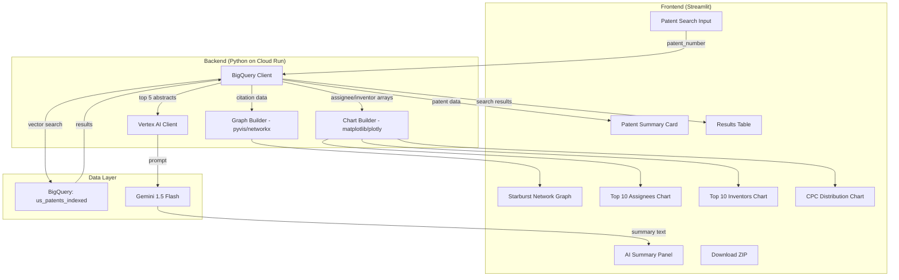
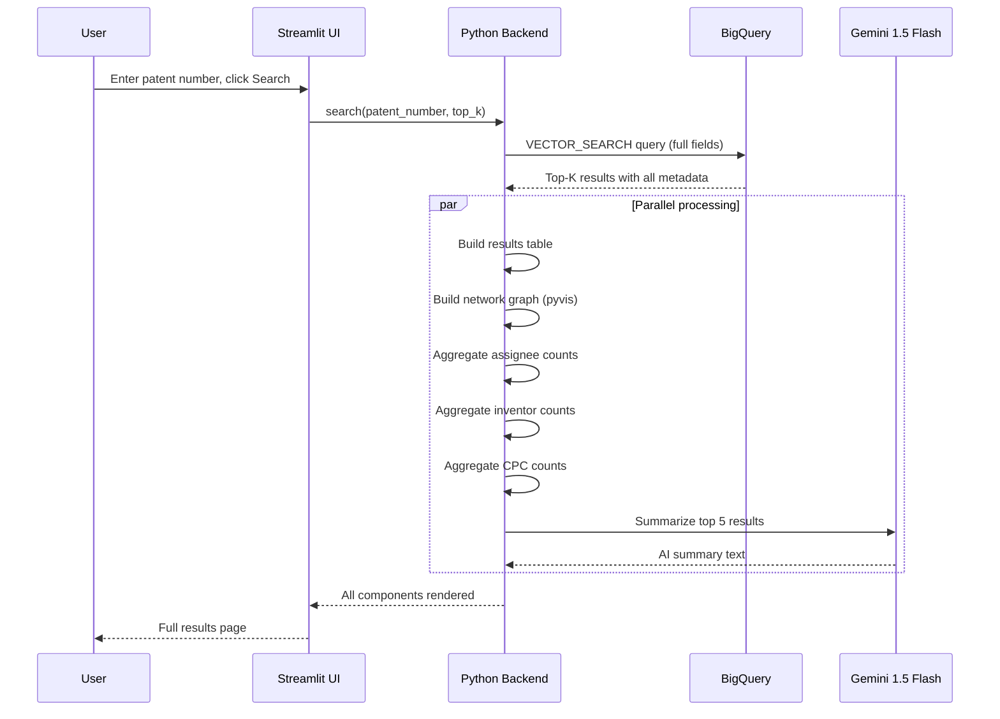
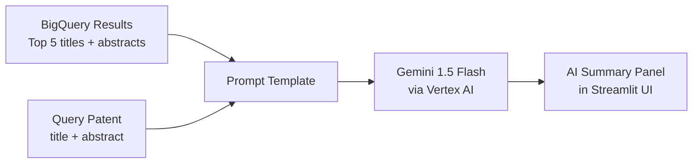
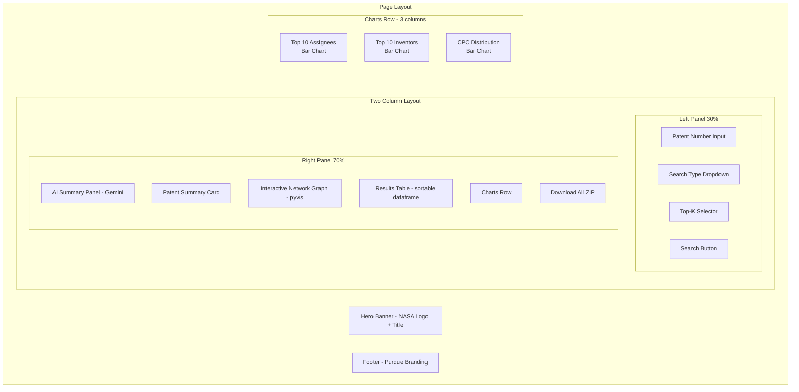

# Full-Stack Specification: NASA Patent Matching Tool

> Maps every UI component to its backend query, data flow, and Gemini integration.

---

## System Overview



---

## Request Flow

When the user clicks "Search," everything flows from a single BigQuery vector search call. One query, multiple UI components.



**Key design decision:** We make ONE BigQuery call and derive everything from it. The old system made dozens of separate GCS reads. We process the results in Python (aggregations, graph building) and call Gemini in parallel.

---

## UI Components and Their Backend Queries

### 1. Patent Search Input

**UI:** Text input field + Search button + Top-K selector

**User action:** Enters a patent number like `US-2007156035-A1` and clicks Search.

**Backend:** No query yet. Just validates the input format and passes to the main search.

```python
# Input validation (same regex pattern the old team used)
import re
pattern = re.compile(r"^[A-Za-z]{2}-?\d+-?[A-Za-z0-9]{2}$")

def valid_patent(s: str) -> bool:
    return bool(pattern.match(s.strip()))
```

---

### 2. Patent Summary Card

**UI:** Displays the searched patent's title, abstract, assignee, inventor, dates.

**Data source:** First row of the vector search results (distance = 0, the patent itself).

**Query:** Same as the main vector search. The first result IS the query patent.

```python
# The query patent is always result #1 (distance = 0)
query_patent = results_df.iloc[0]

# Display fields:
# query_patent['title']
# query_patent['abstract']
# query_patent['primary_assignee']
# query_patent['primary_inventor']
# query_patent['filing_date']
# query_patent['publication_date']
# query_patent['grant_date']
```

**Why not a separate query?** The vector search already returns the query patent as its first result. No need for a second round trip to BigQuery.

---

### 3. Results Table (Primary Results)

**UI:** Sortable table with similarity score, patent number, title, assignee, inventor, filing date.

**Data source:** Main vector search results (excluding the first row which is the query patent itself).

**BigQuery query:**

```sql
SELECT
    base.publication_number,
    base.application_number,
    base.title,
    base.abstract,
    base.primary_assignee,
    base.primary_inventor,
    base.assignee_harmonized,
    base.inventor_harmonized,
    base.filing_date,
    base.publication_date,
    base.cited_by,
    base.citation,
    base.parent,
    base.child,
    base.cpc,
    base.top_terms,
    distance
FROM VECTOR_SEARCH(
    TABLE `grad-589-588.patent_research.us_patents_indexed`,
    'embedding_v1',
    (
        SELECT embedding_v1
        FROM `grad-589-588.patent_research.us_patents_indexed`
        WHERE publication_number = @patent_number
    ),
    top_k => @top_k,
    distance_type => 'COSINE'
)
ORDER BY distance;
```

**Python (parameterized):**

```python
from google.cloud import bigquery

client = bigquery.Client()

query = """
SELECT
    base.publication_number,
    base.application_number,
    base.title,
    base.abstract,
    base.primary_assignee,
    base.primary_inventor,
    base.assignee_harmonized,
    base.inventor_harmonized,
    base.filing_date,
    base.publication_date,
    base.cited_by,
    base.citation,
    base.parent,
    base.child,
    base.cpc,
    base.top_terms,
    distance
FROM VECTOR_SEARCH(
    TABLE `grad-589-588.patent_research.us_patents_indexed`,
    'embedding_v1',
    (
        SELECT embedding_v1
        FROM `grad-589-588.patent_research.us_patents_indexed`
        WHERE publication_number = @patent_number
    ),
    top_k => @top_k,
    distance_type => 'COSINE'
)
ORDER BY distance
"""

job_config = bigquery.QueryJobConfig(
    query_parameters=[
        bigquery.ScalarQueryParameter("patent_number", "STRING", patent_number),
        bigquery.ScalarQueryParameter("top_k", "INT64", top_k),
    ]
)

results_df = client.query(query, job_config=job_config).to_dataframe()
```

**UI display:**

```python
# Remove the query patent itself from display (row 0, distance = 0)
display_df = results_df.iloc[1:].copy()

# Add similarity score (1 - distance for cosine)
display_df['similarity_score'] = 1 - display_df['distance']

# Add rank
display_df['rank'] = range(1, len(display_df) + 1)

# Display columns for the table
table_columns = [
    'rank', 'similarity_score', 'publication_number', 'title',
    'primary_assignee', 'primary_inventor', 'filing_date'
]

st.dataframe(display_df[table_columns], use_container_width=True)
```

---

### 4. Starburst Network Graph

**UI:** Interactive graph (pyvis) showing the query patent at center, search results around it, and citation/family connections as edges.

**Data source:** Same vector search results. Uses `cited_by`, `citation`, `parent`, `child` arrays.

**Python (graph construction from the same results_df):**

```python
import networkx as nx
from pyvis.network import Network

def build_patent_graph(results_df, query_patent_number):
    G = nx.DiGraph()

    # Add query patent as center node
    G.add_node(query_patent_number, type="query")

    for _, row in results_df.iterrows():
        pub = row['publication_number']

        # Add result node
        if pub != query_patent_number:
            G.add_edge(query_patent_number, pub, relation="similar")

        # Forward citations (patents that cite this one)
        if row['cited_by']:
            for cite in row['cited_by']:
                citing_pub = cite.get('publication_number', '')
                if citing_pub:
                    G.add_edge(citing_pub, pub, relation="cites")

        # Backward citations (patents this one cites)
        if row['citation']:
            for cite in row['citation']:
                cited_pub = cite.get('publication_number', '')
                if cited_pub:
                    G.add_edge(pub, cited_pub, relation="cites")

        # Parent applications
        if row['parent']:
            for parent in row['parent']:
                parent_pub = parent.get('publication_number', '')
                if parent_pub:
                    G.add_edge(parent_pub, pub, relation="parent")

        # Child applications
        if row['child']:
            for child in row['child']:
                child_pub = child.get('publication_number', '')
                if child_pub:
                    G.add_edge(pub, child_pub, relation="child")

    return G
```

**Edge colors (same scheme the old team used):**

| Relation | Color | Meaning |
|----------|-------|---------|
| similar | `#66ff66` (green) | Query → search result |
| cites | `#00ccff` (blue) | Citation relationship |
| parent | `#ff9900` (orange) | Parent application |
| child | `#ff3366` (red) | Child application |

---

### 5. Top 10 Assignees Chart

**UI:** Horizontal bar chart showing companies with the most patents in the search results.

**Data source:** `assignee_harmonized` arrays from the same results_df, flattened and counted in Python.

**Python (from same results_df, no second BigQuery call):**

```python
from collections import Counter

def get_top_assignees(results_df, top_n=10):
    all_assignees = []
    for _, row in results_df.iterrows():
        if row['assignee_harmonized']:
            for assignee in row['assignee_harmonized']:
                name = assignee.get('name', '')
                if name:
                    all_assignees.append(name)

    counts = Counter(all_assignees).most_common(top_n)
    return counts
```

**Alternative (if you want to do it in BigQuery for larger top_k):**

```sql
WITH search_results AS (
    SELECT base.assignee_harmonized
    FROM VECTOR_SEARCH(
        TABLE `grad-589-588.patent_research.us_patents_indexed`,
        'embedding_v1',
        (
            SELECT embedding_v1
            FROM `grad-589-588.patent_research.us_patents_indexed`
            WHERE publication_number = @patent_number
        ),
        top_k => @top_k,
        distance_type => 'COSINE'
    )
)
SELECT
    assignee.name AS assignee_name,
    COUNT(*) AS patent_count
FROM search_results,
    UNNEST(assignee_harmonized) AS assignee
WHERE assignee.name IS NOT NULL AND assignee.name != ''
GROUP BY assignee_name
ORDER BY patent_count DESC
LIMIT 10;
```

**When to use which:**
- top_k <= 100: process in Python from the main query results (faster, no extra BigQuery call)
- top_k > 100: use the BigQuery aggregation query (let BigQuery handle the heavy counting)

---

### 6. Top 10 Inventors Chart

**UI:** Horizontal bar chart showing inventors with the most patents in the search results.

**Data source:** `inventor_harmonized` arrays from results_df, same pattern as assignees.

**Python (from same results_df):**

```python
def get_top_inventors(results_df, top_n=10):
    all_inventors = []
    for _, row in results_df.iterrows():
        if row['inventor_harmonized']:
            for inventor in row['inventor_harmonized']:
                name = inventor.get('name', '')
                if name:
                    all_inventors.append(name)

    counts = Counter(all_inventors).most_common(top_n)
    return counts
```

**BigQuery alternative (for large top_k):**

```sql
WITH search_results AS (
    SELECT base.inventor_harmonized
    FROM VECTOR_SEARCH(
        TABLE `grad-589-588.patent_research.us_patents_indexed`,
        'embedding_v1',
        (
            SELECT embedding_v1
            FROM `grad-589-588.patent_research.us_patents_indexed`
            WHERE publication_number = @patent_number
        ),
        top_k => @top_k,
        distance_type => 'COSINE'
    )
)
SELECT
    inventor.name AS inventor_name,
    COUNT(*) AS patent_count
FROM search_results,
    UNNEST(inventor_harmonized) AS inventor
WHERE inventor.name IS NOT NULL AND inventor.name != ''
GROUP BY inventor_name
ORDER BY patent_count DESC
LIMIT 10;
```

---

### 7. CPC Technology Distribution Chart

**UI:** Bar chart showing CPC section letters (A-H, Y) and their frequency.

**Data source:** `cpc` arrays from results_df.

**Python (from same results_df):**

```python
def get_cpc_distribution(results_df):
    cpc_letters = []
    for _, row in results_df.iterrows():
        if row['cpc']:
            for entry in row['cpc']:
                code = entry.get('code', '')
                if code and code[0].isalpha():
                    cpc_letters.append(code[0].upper())

    counts = Counter(cpc_letters).most_common()
    return counts
```

**CPC section reference (for chart labels):**

| Letter | Technology Area |
|--------|----------------|
| A | Human Necessities (medical, agriculture, food) |
| B | Operations / Transport (vehicles, printing, weapons) |
| C | Chemistry / Metallurgy |
| D | Textiles / Paper |
| E | Fixed Constructions (buildings, mining) |
| F | Mechanical Engineering (engines, pumps, lighting) |
| G | Physics (instruments, computing, optics) |
| H | Electricity (power, circuits, communication) |
| Y | Emerging / Cross-sectional Technologies |

---

### 8. AI Summary Panel (Gemini Integration)

**UI:** A text panel that displays a natural-language summary of the search results, written as a NASA innovation brief.

**Data source:** Top 5 results from the vector search (title + abstract), sent to Gemini 1.5 Flash.

**Where it fits in the flow:**



**Python:**

```python
import vertexai
from vertexai.generative_models import GenerativeModel

vertexai.init(project="grad-589-588", location="us-central1")
model = GenerativeModel("gemini-2.5-flash")

def generate_summary(query_patent, top_results):
    """
    query_patent: dict with 'title', 'abstract', 'publication_number'
    top_results: list of dicts (top 5 search results, each with title + abstract)
    """

    results_text = ""
    for i, r in enumerate(top_results, 1):
        results_text += f"""
Result {i}: {r['publication_number']}
Title: {r['title']}
Assignee: {r['primary_assignee']}
Abstract: {r['abstract']}
Similarity: {1 - r['distance']:.2%}
---
"""

    prompt = f"""You are a patent analyst at NASA's Technology Transfer Office.

A user searched for patent {query_patent['publication_number']}:
Title: {query_patent['title']}
Abstract: {query_patent['abstract']}

The following are the top 5 most semantically similar patents found:

{results_text}

Write a brief (3-5 paragraph) analysis that:
1. Summarizes what technical space this patent operates in
2. Identifies the key companies and inventors active in this space
3. Highlights any notable patterns (e.g., multiple patents from the same assignee,
   clustering of filing dates, convergence of approaches)
4. Suggests potential licensing or collaboration opportunities for NASA

Write in plain professional language. Avoid legal jargon. Focus on actionable insights
that a Technology Transfer Officer could use to identify potential licensees."""

    response = model.generate_content(prompt)
    return response.text
```

**When to call it:**
- After the BigQuery results come back
- Run in parallel with chart/graph building (non-blocking)
- Display in a separate panel or expandable section

**Cost estimate:** Gemini 1.5 Flash at ~$0.075 per 1M input tokens. A typical prompt with 5 abstracts is ~2,000 tokens. Cost per query: ~$0.00015 (negligible).

---

## Full Page Layout



---

## Backend Architecture Summary

```
User clicks Search
       |
       v
Python receives patent_number + top_k
       |
       v
ONE BigQuery VECTOR_SEARCH call
       |
       +---> results_df (pandas DataFrame with all fields)
       |
       +---> [Row 0] ---------> Patent Summary Card
       |
       +---> [Rows 1-N] ------> Results Table
       |
       +---> cited_by/citation/parent/child --> Graph Builder --> Network Graph
       |
       +---> assignee_harmonized --> Counter --> Top 10 Assignees Chart
       |
       +---> inventor_harmonized --> Counter --> Top 10 Inventors Chart
       |
       +---> cpc --> Counter -----> CPC Distribution Chart
       |
       +---> [Top 5 abstracts] --> Gemini 1.5 Flash --> AI Summary Panel
       |
       v
All components rendered in Streamlit
```

**Total backend calls per user search:**
- 1x BigQuery VECTOR_SEARCH
- 1x Vertex AI Gemini call
- **That's it. Two API calls total.**

The old system made: 1 papermill subprocess + 1 model load + 1 FAISS search + N parquet reads + N second-level searches + visualization generation. Our two calls replace all of that.

---

## Dependencies

```
# requirements.txt for Cloud Run deployment
streamlit
google-cloud-bigquery
google-cloud-aiplatform
vertexai
pandas
pyvis
networkx
matplotlib
plotly
```

---

## Environment Variables

```
GOOGLE_CLOUD_PROJECT=grad-589-588
BIGQUERY_DATASET=patent_research
BIGQUERY_TABLE=us_patents_indexed
VERTEX_AI_LOCATION=us-central1
GEMINI_MODEL=gemini-2.5-flash
```
